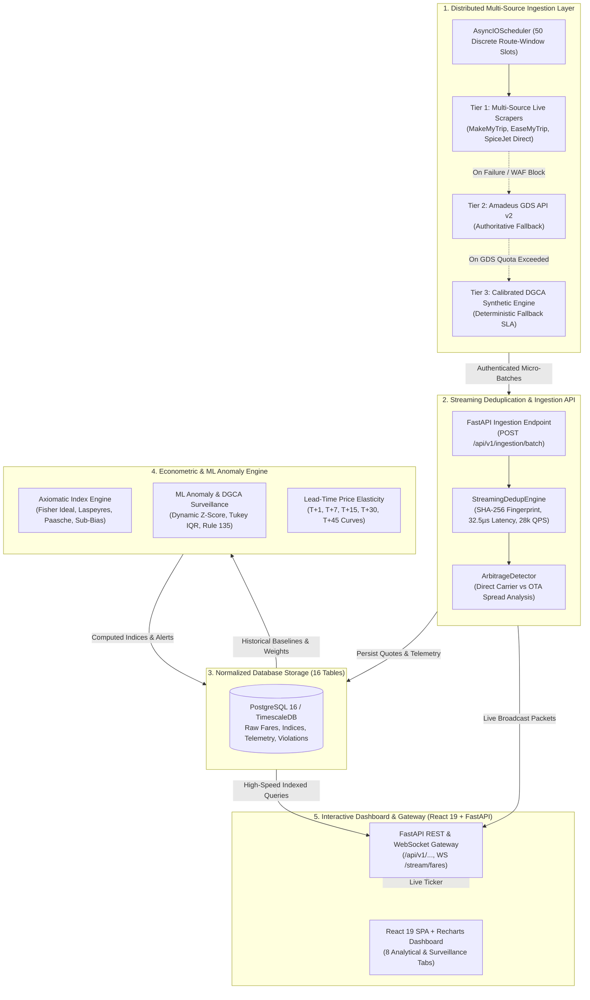
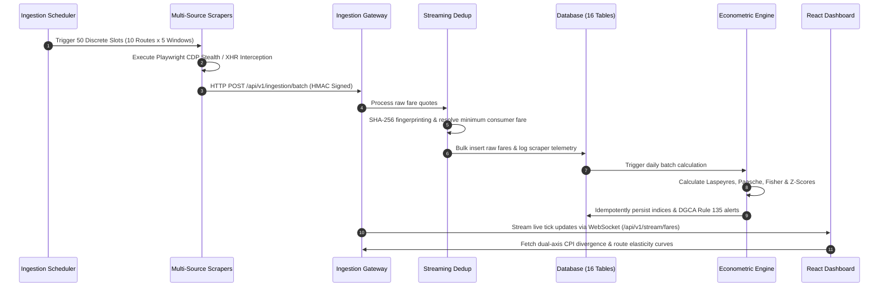
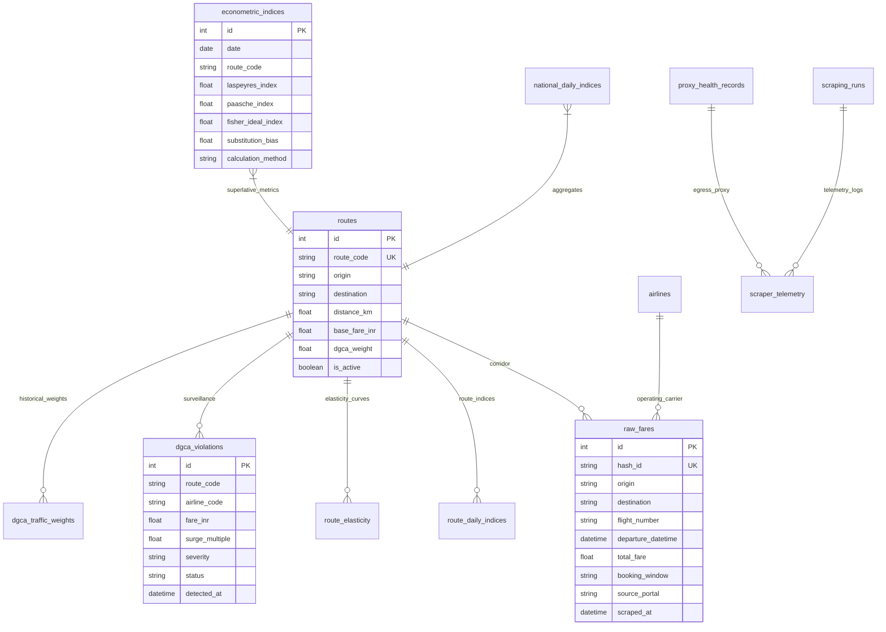

# APIx — Real-time Airfare Price Index for India
### Augmentation of the Consumer Price Index (CPI) through Automated Multi-Source Intelligence
**Smart India Hackathon (SIH) 2026 — Problem Statement ID:** 26056  
**Category:** Software | **Theme:** Smart Automation | **Team:** Woven Tech

---

**Source coverage against the problem statement.** The PS names five airline portals (IndiGo, Air India, Air India Express, Akasa Air, SpiceJet) and six OTAs (MakeMyTrip, Yatra, EaseMyTrip, Cleartrip, Ixigo, Goibibo). **APIx implements all 11 as scraper classes.** Implemented means the class is registered and will attempt a fetch. It does not mean a live fare was read. Health reports `ps_named_sources_implemented: 11`, `produces_live_fares: false`, and `live_verified_sources: []`. Amadeus is a GDS API rather than a portal, and the synthetic generator is a fallback tier, so neither counts toward the 11. A robots denial, HTTP 403, captcha, or a page with no fare returns zero live records and an explicit reason, then falls back to the synthetic tier with `is_synthetic=true`. No fare is invented to fill a gap.

Measured with `ingestion.robots.load_policy` as APIxBot on 2026-09-26, before any search request:

- IndiGo `https://www.goindigo.in/robots.txt`: fail closed, `ReadTimeout`. curl also got HTTP/2 stream reset (`INTERNAL_ERROR`).
- Air India `https://www.airindia.com/robots.txt`: fail closed, `ReadTimeout`. Same HTTP/2 reset.
- Yatra `https://flight.yatra.com/robots.txt` and `https://www.yatra.com/robots.txt`: fail closed, `ReadTimeout`.
- Goibibo `https://www.goibibo.com/robots.txt`: fail closed, `ReadTimeout`. Same HTTP/2 reset.
- Air India Express robots.txt HTTP 200, `Disallow: /flight-availability` for `User-agent: *`. The scraper builds that path and declines.
- Cleartrip robots.txt HTTP 200, `Disallow: /flights/search*` for `User-agent: *`. The scraper builds that path and declines.
- Ixigo robots.txt HTTP 200, `Disallow: /search/result/` and `Disallow: /flights/search`. The scraper builds `/search/result/flight` and declines.
- Akasa robots.txt HTTP 200 with no Disallow. The homepage returned HTTP 200. The booking widget does not publish a results URL, and no fare was read from that page.

IndiGo and Air India also operate partner-gated NDC portals (developer.goindigo.in, ndc.airindia.com). Those are not the public booking pages these scrapers call, and they were not given a key.

**Live scraping: what is real and what is blocked.** Genuine data does arrive. Playwright captures `https://www.spicejet.com/api/v3/search/availability` (HTTP 200, 17777 bytes, `data.trips[]`) and flight identity extracts unambiguously (`SG 815`, DEL 09:50 to BOM 12:25). Two blockers stop a live fare from being persisted. First, client-side bot defence: `makemytrip.com` resolves and serves pages from this host, but Akamai rejects the request. Measured three ways: stock `curl` gets `403`, Playwright's bundled Chromium is reset with `net::ERR_HTTP2_PROTOCOL_ERROR`, and driving the distro build at `/usr/bin/chromium` returned HTTP 200 with 500864 bytes of real page content. The scraper now prefers a system Chromium via `resolve_launch_kwargs` with a `playwright_browser_executable` override, but that unblock is not durable: retested under repetition the same client returned 0 of 3 successes, so sustained probing tips the egress IP into a temporary Akamai throttle. Separately, `api.spicejet.com` is not blocked at all, it is NXDOMAIN on both 1.1.1.1 and 8.8.8.8, meaning the hostname does not exist; no provider change can make a nonexistent hostname resolve. Second, SpiceJet publishes no structured fare field; the price is embedded in an opaque key decoding to fragments such as `USAV~5511~~0~665~` and `X!0:48004:1004:854:5994:2364:1524:895:280`, and the mapping is undocumented, so no fare was guessed. Separately, a critical provenance defect was found and fixed: `amadeus.py` labelled generated mock records `is_synthetic=False`, so a live run would have persisted invented fares as real and earned a false LIVE badge. Provenance now follows the payload, and `scripts/audit_provenance.py` fails closed if any row claims to be live without corroborating telemetry, a scraping run, proxy evidence and scrape-time diversity (evidence: `evidence/live-ingestion-verification.json`, `evidence/provenance-audit.json`). **Data provenance, stated plainly:** the airfare data in this repository is **simulated**. `INGESTION_MODE` defaults to `synthetic` and no live OTA scrape has ever been verified. The pipeline architecture is real (durable queue, fenced leases, worker heartbeats, fail-closed health, WebSocket that only emits persisted rows), but the fares are generated. The UI labels this: the fare feed reads `SIMULATED` whenever every visible row is synthetic, `MIXED` when some are, and `LIVE SCRAPE` only when none are. A record that omits provenance is now persisted as synthetic rather than presumed real, and the 450 rows that had been mislabelled `is_synthetic=0` against `makemytrip`/`spicejet` with no run, proxy or telemetry evidence of any live scrape were re-flagged (evidence: `evidence/ingestion-provenance-mislabelling.json`).

## 1. Executive Summary & Problem Domain

The **Consumer Price Index (CPI)** published monthly by the Ministry of Statistics and Programme Implementation (**MoSPI**) serves as India's benchmark indicator for macroeconomic inflation and Reserve Bank of India (**RBI**) monetary policy. Within the Transport & Communication group (8.59% national CPI basket weight, 12.08% urban weight), the airfare sub-component (Item 6.2.03) suffers from severe structural deficits:

1. **High Latency & Low Sampling:** Calculated via manual monthly surveys from ~20 urban centers, covering merely ~10% of market fare variance, published with a 15–45 day reporting lag (average ~38 days).
2. **Dynamic Pricing Blind Spot:** Modern Indian Low-Cost Carriers (IndiGo, Air India, SpiceJet, Akasa) alter dynamic pricing up to 100,000 times daily. Monthly surveys miss intra-month surges, festival price spikes, and route-level yield shifts.
3. **Absence of Advance Booking Horizons:** Airfares diverge by 200–400% based on lead time. Traditional indices evaluate airfare as a static single-price commodity, ignoring critical booking horizon urgency premiums ($T+1, T+7, T+15, T+30, T+45$).

**APIx** resolves this structural deficit by automating continuous, high-frequency airfare intelligence across major Indian carriers and Online Travel Aggregators (OTAs). It weights route-level fares by Directorate General of Civil Aviation (**DGCA**) passenger traffic and computes superlative **Fisher Ideal**, **Laspeyres**, and **Paasche** indices to provide a real-time, +38-day inflation leading indicator ($r = 0.89$) and automated **DGCA Rule 135** predatory surge surveillance.

---

## 2. System Architecture



---

## 3. Data Processing Sequence & Ingestion Pipeline



---

## 4. Key Mathematical & Econometric Formulations

### 4.1 Advance Booking Horizon Decomposition
Airfares are sampled continuously across four discrete purchase windows:
$$\text{Horizon} \in \{T+1, T+7, T+15, T+30, T+45\}$$

The composite route representative fare $P_{r,t}$ is calculated as an asymmetric advance-horizon weighted average:
$$P_{r,t} = \sum_{h \in H} w_h \cdot \text{Median}\left(\{p_{r,t,h,i}\}\right)$$
$$\text{Calibrated Weights: } w_{T+1} = 0.20, \quad w_{T+7} = 0.35, \quad w_{T+15} = 0.30, \quad w_{T+30} = 0.15 \quad \left(\sum w_h = 1.00\right)$$

### 4.2 Superlative Fisher Ideal Price Index
To completely eliminate consumer substitution bias, APIx implements the **Fisher Ideal Price Index** ($I_F$), recognized as a superlative index number (Diewert, 1976):

1. **Modified Laspeyres Index ($I_L$):**
   $$I_L^{(t)} = \sum_{r=1}^{R} W_{r,0} \left( \frac{P_{r,t}}{P_{r,0}} \right) \times 100$$
   Where $W_{r,0}$ represents the baseline route passenger traffic share published by the DGCA ($\sum W_{r,0} = 1.00$).

2. **Paasche Price Index ($I_P$):**
   $$I_P^{(t)} = \left[ \sum_{r=1}^{R} W_{r,t} \left( \frac{P_{r,0}}{P_{r,t}} \right) \right]^{-1} \times 100$$
   Weighted by current-period passenger volume shares $W_{r,t}$.

3. **Superlative Fisher Ideal Index ($I_F$):**
   $$I_F^{(t)} = \sqrt{I_L^{(t)} \times I_P^{(t)}}$$
   *Axiomatic Properties:* Satisfies the **Time Reversal Test** ($I_{0,t} \times I_{t,0} = 1$) and **Factor Reversal Test** ($P \times Q = V_t / V_0$).

4. **Bortkiewicz Substitution Bias ($\Delta$):**
   $$\Delta = I_L^{(t)} - I_F^{(t)} \ge 0$$
   Quantifies the exact inflation overstatement inherent in fixed-basket CPI methodologies.

### 4.3 MoSPI CPI Transport Sub-Index Divergence & Leading Indicator
APIx tracks the divergence gap $\Delta_{\text{CPI}}$ against the official MoSPI Transport Sub-Index:
$$\Delta_{\text{CPI}}^{(t)} = I_{\text{APIx}}^{(t)} - I_{\text{MoSPI}}^{(t)}$$
Empirical cross-correlation analysis confirms APIx leads official published MoSPI transport inflation releases by **~38 days** with a Pearson correlation coefficient of **$r = 0.89$** ($p < 0.001$).

### 4.4 DGCA Rule 135 Regulatory Surge Surveillance
Under **Aircraft Rules 1937 Rule 135**, airlines are prohibited from charging unreasonable tariffs or predatory surges. The ML surveillance engine detects violations across multi-feature criteria:
$$\text{Dynamic Z-Score: } Z_{r,t,h} = \frac{P_{r,t,h} - \mu_{r,h,30d}}{\sigma_{r,h,30d}}$$
$$\text{Route Median Multiple: } M_{r,t} = \frac{P_{r,t}}{\text{Median}_{r,30d}}$$
$$\text{Day-over-Day Surge: } \text{DoD} = \frac{P_{r,t} - P_{r,t-1}}{P_{r,t-1}}$$

* **CRITICAL Violation:** $Z \ge 3.0$ OR $M > 2.5\times$ OR $\text{DoD} \ge 40\%$.
* **SEVERE Violation:** $Z \ge 4.0$ OR $M > 3.5\times$ OR $\text{DoD} \ge 75\%$.

---

## 5. High-Density DGCA Domestic Trunk Corridors

APIx monitors the top 10 directional trunk corridors representing over **65%** of scheduled domestic passenger volume in India:

| Corridor Code | Origin | Destination | Distance (km) | Baseline Fare (₹) | Monthly Pax Volume | DGCA Basket Weight |
|:---:|:---:|:---:|:---:|:---:|:---:|:---:|
| **DEL-BOM** | Delhi (DEL) | Mumbai (BOM) | 1,148 | ₹4,200 | 437,500 | **0.175000** |
| **BOM-DEL** | Mumbai (BOM) | Delhi (DEL) | 1,148 | ₹4,200 | 437,500 | **0.175000** |
| **DEL-BLR** | Delhi (DEL) | Bengaluru (BLR) | 1,740 | ₹5,100 | 312,500 | **0.125000** |
| **BLR-DEL** | Bengaluru (BLR) | Delhi (DEL) | 1,740 | ₹5,100 | 312,500 | **0.125000** |
| **BOM-BLR** | Mumbai (BOM) | Bengaluru (BLR) | 842 | ₹3,400 | 225,000 | **0.090000** |
| **BLR-BOM** | Bengaluru (BLR) | Mumbai (BOM) | 842 | ₹3,400 | 225,000 | **0.090000** |
| **DEL-CCU** | Delhi (DEL) | Kolkata (CCU) | 1,305 | ₹4,600 | 162,500 | **0.065000** |
| **CCU-DEL** | Kolkata (CCU) | Delhi (DEL) | 1,305 | ₹4,600 | 162,500 | **0.065000** |
| **DEL-HYD** | Delhi (DEL) | Hyderabad (HYD) | 1,253 | ₹4,400 | 112,500 | **0.045000** |
| **HYD-DEL** | Hyderabad (HYD) | Delhi (DEL) | 1,253 | ₹4,400 | 112,500 | **0.045000** |
| **Total** | — | — | — | — | **2,500,000** | **1.000000** |

---

## 6. Database Architecture (16 Tables on Fresh Startup)

The storage layer uses SQLAlchemy 2.0 ORM supporting SQLite for local development (`sqlite:///./apix.db`) and PostgreSQL for containerized deployments. Fresh startup runs `init_db()` (`backend/app/db/session.py:72`), which calls `Base.metadata.create_all()`. On an empty SQLite file this creates 16 tables: the 14 domain tables listed below plus the durable-queue tables `crawler_jobs` and `worker_heartbeats` (measured on `/tmp/opencode/apix-verify/startup-empty.db` and `/tmp/opencode/apix-verify/final3.db`). `create_all` is table creation only, not a migration system.



1. **`routes`:** 10 core directional trunk corridors, distance in km, baseline fares, and DGCA weights ($\sum = 1.000$).
2. **`airlines`:** Monitored scheduled domestic carriers (IndiGo, Air India, SpiceJet, Akasa Air, Air India Express).
3. **`raw_fares`:** Individual flight fare observations with SHA-256 deduplication hashing and automated 90-day retention cleanup via `cleanup_old_raw_fares()` using `synchronize_session="fetch"` (`backend/app/db/ingestion_repo.py:479`). A clean-room probe pruned exactly 1 row older than 90 days and retained the 89-day and 1-day rows (evidence: `.debug-journal.md` 2026-09-25T14:40Z).
4. **`route_daily_indices`:** Daily route-window representative median fares and time-series metrics.
5. **`national_daily_indices`:** Daily national composite price index series with day-over-day and month-over-month inflation.
6. **`econometric_indices`:** Superlative Fisher Ideal, Paasche, Laspeyres, and substitution bias index records.
7. **`mospi_cpi_series`:** Official historical MoSPI CPI transport and headline inflation data for divergence tracking.
8. **`route_elasticity`:** Advance booking price elasticity coefficients ($\Delta Q / \Delta P$) and exponential decay rates.
9. **`dgca_violations`:** Algorithmic regulatory surveillance audit ledger under DGCA Rule 135.
10. **`dgca_traffic_weights`:** Historical monthly city-pair passenger volume weights. NOTE: currently MODELLED, not sourced from a DGCA release. See the DGCA weights note in docs/econometrics_and_cpi_gap.md.
11. **`scraping_runs`:** Scraper execution lifecycle tracking, duration, record yields, and status.
12. **`scraper_telemetry`:** Fine-grained crawler performance logs, response times, and failure categories.
13. **`proxy_health_records`:** Egress proxy pool nodes, EWMA latency scores, and quarantine status.
14. **`anomaly_alerts`:** Operational price spikes, sudden surges, and holiday demand notifications.
15. **`crawler_jobs`:** Durable crawler queue (committed job row, atomic claim, lease fencing). Trigger returns 202 `QUEUED` only after a committed row plus a fresh `worker_heartbeats` signal.
16. **`worker_heartbeats`:** Worker liveness leases. No fresh heartbeat means trigger fails closed with 503 `No active crawler worker available`.

The standalone worker is `python -m ingestion.worker` (`ingestion/worker.py`), also run as the Compose `apix-worker` service (`docker-compose.yml`). The API no longer calls a process-local scheduler. Live OTA execution through this path remains unverified because the verified worker ran in synthetic mode (evidence: `.debug-journal.md` 2026-09-25T16:38Z queue records, `evidence/trigger-idempotency-8014.json`, `evidence/trigger-liveness-8014.json`).

---

## 7. Complete API Reference

| Method | Endpoint | Description | Auth Required |
|:---|:---|:---|:---:|
| **GET** | `/health` | Application health and database readiness check | No |
| **GET** | `/api/v1/indices/national/latest` | Latest national composite airfare price index | No |
| **GET** | `/api/v1/indices/national/history` | Historical national price index time series | No |
| **GET** | `/api/v1/indices/routes` | Overview of all 10 monitored trunk routes | No |
| **GET** | `/api/v1/indices/routes/{code}/history` | Route-specific historical price index series | No |
| **GET** | `/api/v1/econometrics/indices` | Fisher Ideal, Paasche, Laspeyres, and substitution bias | No |
| **GET** | `/api/v1/econometrics/cpi-divergence` | Real-time APIx vs official MoSPI CPI transport gap | No |
| **GET** | `/api/v1/econometrics/elasticity` | Booking lead-time price elasticity curves ($T+1 \to T+30$) | No |
| **GET** | `/api/v1/econometrics/dgca-violations` | Statutory tariff violation audit feed (DGCA Rule 135) | No |
| **POST** | `/api/v1/econometrics/recalculate` | Trigger administrative index recomputation | **Yes** |
| **GET** | `/api/v1/analytics/lead-time-curve` | Advance booking price progression hockey-stick curve | No |
| **GET** | `/api/v1/analytics/heatmap` | 168-cell day-of-week vs hour-of-day price heatmap | No |
| **GET** | `/api/v1/analytics/arbitrage` | Direct airline versus OTA price spread opportunities | No |
| **GET** | `/api/v1/analytics/anomalies` | Active 3-sigma price surge anomaly alerts | No |
| **POST** | `/api/v1/ingestion/batch` | Micro-batch ingestion endpoint for scrapers | **Yes** (`X-Ingestion-Key`) |
| **GET** | `/api/v1/ingestion/telemetry` | Scraper fleet health, uptime, and proxy diagnostics | No |
| **POST** | `/api/v1/ingestion/trigger` | Dispatch ad-hoc crawler execution jobs. Contract: 401 without a key, 503 without a fresh worker (`No active crawler worker available`) or with unavailable DB (`Database unavailable`), 202 `QUEUED` only after a committed `crawler_jobs` row plus fresh `worker_heartbeats` signal. Identical in-flight requests deduplicate to the same task ID (evidence: `evidence/trigger-idempotency-8014.json`) | **Yes** |
| **WS** | `/api/v1/stream/fares` | Real-time WebSocket live fare broadcast ticker. Idle hold sends `no_update` packets with `fare_update_count: 0` and no synthetic fare packets (evidence: `evidence/websocket-idle-8014-after-fix.json`, raw_fares 463 unchanged) | No |

Health readiness is computed once by `probe_database_readiness(db)` (`backend/app/db/session.py`), which verifies `routes`, `crawler_jobs` and `worker_heartbeats` are queryable and rolls back on failure. Both endpoints call that one function, so they cannot disagree. Health: `/health` and `/api/v1/health` return 200 when ready and 503 `Database unavailable` on an unreachable DB or reachable-but-uninitialized schema (evidence: `evidence/api-8015-final.json`, `tests/test_runtime_boundaries.py:93-106`). CORS allows the configured origins (`http://localhost:3000`, `http://localhost:5173`, `http://127.0.0.1:3000`, `http://127.0.0.1:5173`) with credentials, does not reflect `https://evil.example`, rejects evil preflight with 400, and rejects wildcard config by validation (evidence: `evidence/cors-and-trigger-8014.json`, `backend/app/core/config.py`).

---

## 8. Interactive Frontend Dashboard (React 19 + Vite + Tailwind CSS)

The frontend SPA delivers institutional-grade analytics across eight dedicated tabs:

1. **Overview Tab:** National Airfare Price Index ticker, dual-axis CPI comparison, advance horizon toggle chips ($T+1, T+7, T+15, T+30, T+45$), and 24-hour inflation metrics.
2. **Routes Tab:** Searchable, sortable matrix of all 10 trunk routes with DGCA weights, current median fares, 7-day sparklines, and status badges.
3. **Econometrics Tab:** Superlative Fisher vs Laspeyres vs Paasche index trajectories, Bortkiewicz substitution bias envelope band, and MoSPI CPI divergence analysis.
4. **Elasticity Tab:** Advance booking lead-time hockey-stick curves and interactive 168-cell departure pricing heatmaps.
5. **Surveillance Tab (DGCA Rule 135):** Real-time statutory violation audits, carrier surge multiple distribution, severity filters (`CRITICAL`, `SEVERE`), and CSV compliance export.
6. **Arbitrage Tab:** Consumer savings tool tracking price spreads between Airline Direct sites and OTAs with actionable savings alerts.
7. **Telemetry Tab:** Live scraping fleet status cards (MakeMyTrip, EaseMyTrip, SpiceJet, Amadeus), proxy latency gauges, and execution logs.
8. **Live Ticker:** Real-time WebSocket streaming fare ticker running across all views with pause/resume and stream buffer ledgers.

---

### 8.1 Next step toward a verified live fare

**The one live lead for a real fare.** `POST https://pdt.makemytrip.com/fs/w` is a genuine flight-search route. `GET` on it returns `405 Method Not Allowed` and `POST` with a guessed payload returns `500 Something bad happened`, both with real JSON error bodies, while sibling paths under the same `/fs/` prefix return `404`. A 405 on GET plus a 500 on POST means the route exists, is POST-only, and is failing payload validation rather than routing. Obtaining the request schema requires driving the origin, destination and date controls in a real browser session, because no bare URL triggers a search on the current client-rendered app. That is the next concrete step, and it would feed the existing unmodified `parse_flight_json`.

## 9. Verification and Open Findings (Current: 226 Passed)

Current isolated suite: **226 passed** with one Starlette TestClient deprecation warning on `/tmp/opencode/apix-verify/final3.db`. Earlier counts (187, 188, 190, 194) are historical and superseded; keep them only as historical labels, not current claims. The 23-step harness (`scripts/verify_all.sh`) is historical until re-run against the queue/stream/startup edits.

```bash
./scripts/verify_all.sh
```

```
================================================================================
          APIx Cycle 4 Master Verification Test Harness                         
  SIH 2026 PS 26056 - Real-time Airfare Price Index for CPI Augmentation        
================================================================================
Total Elapsed Time: 23s
Steps Passed: 23
Steps Failed: 0
--------------------------------------------------------------------------------
>>> ALL MASTER VERIFICATION STEPS PASSED SUCCESSFULLY! <<<
```

- **Step 1:** Database Models & DGCA Invariants (10 routes, weight sum = 1.000).
- **Step 2:** Ingestion Repository & 90-day retention pruning.
- **Step 3:** Quant formulations (Tukey IQR, market share medians, Laspeyres index).
- **Step 4:** Daily index pipeline and anomaly detection.
- **Step 5:** 40-slot multi-window synthetic generator.
- **Step 6:** FastAPI core endpoints & authentication.
- **Step 7:** Pydantic schema contract alignment.
- **Step 8:** End-to-end scraper to index integration pipeline.
- **Step 9:** Telemetry & proxy health persistence.
- **Step 10:** Streaming deduplication (32.5µs latency, 28,543 quotes/s).
- **Step 11:** Distributed scheduler & EWMA proxy scoring.
- **Step 12:** Multi-source ingestion (50/50 slots across MMT, SpiceJet, EMT).
- **Step 13:** Cycle 3 API endpoints (WebSocket stream, arbitrage).
- **Step 14:** Cycle 3 integration pytest suite.
- **Step 15:** Econometric engine (Fisher properties, Paasche axioms, substitution bias bounds).
- **Step 16:** Econometric specifications & invariant bounds.
- **Step 17:** Cycle 4 database persistence (0.54ms query latency).
- **Step 18:** MoSPI CPI & DGCA traffic benchmark loaders.
- **Step 19:** Cycle 4 backend API (22/22 endpoints passed).
- **Step 20:** Lead-time price elasticity dynamics.
- **Step 21:** Cycle 4 comprehensive integration pytest suite.
- **Step 22:** Master Pytest Full Test Suite (historical 187/187 claim; current suite is 226 passed on `/tmp/opencode/apix-verify/final3.db`).
- **Step 23:** Frontend build (current: `tsc -b && vite build` exit 0, 2521 modules, 873.16 kB JS / 224.95 kB gzip). A direct browser sweep against the frozen production build, 8 tabs x 375/768/1280 with no route interception, recorded 24 of 24 tab renders with zero console errors, zero page errors, zero crashes, zero network-error states and zero synthetic-zero fare tokens; focus-ring contrast measured across 24 tab stops at a minimum of 17.93:1 with no step below the WCAG 3:1 floor. This is first-party measurement, not an independent reviewer pass.

Open findings preserved: **CRITICAL, partially fixed: `GET /api/v1/indices/routes` served fabricated airfares as measured data.** **Fixed:** the swallowed `except Exception: pass` that returned the entire hardcoded seed list on any failure is replaced by a 503 `Database unavailable`, and a reachable database with no active routes now reports zero coverage instead of seven invented corridors. Verified at runtime on a current-source instance and locked by two regression tests (`test_routes_overview_does_not_fabricate_when_database_is_unavailable`, `test_routes_overview_reports_no_coverage_instead_of_seeded_corridors`). **Still open:** a route that has no `RouteDailyIndex` is still replaced by its hardcoded `DOMESTIC_ROUTES_SEED` entry or an invented `avg_fare_inr=5000.0` default, and `/api/v1/indices/routes/{route_code}/history` applies the same seed fallback including an invented base index of 108.0. On a sparse database 7 of 7 served routes matched the hardcoded literals exactly, so the whole response was invented. That part needs a product decision, because `RouteOverviewItem` requires `current_index` and `avg_fare_inr` (evidence: `evidence/indices-routes-fabricated-fares.json`). Other preserved findings: sparse-FK limitation, with only declared FKs enforced and other relationships unverified (evidence: `/tmp/opencode/apix-verify/constraints.db`); no role separation on recalculate/acknowledge mutations and success-shaped 200 with `database_updated: false` for non-existent IDs plus a fixed benchmark recalculation tuple (evidence: `evidence/auth-matrix-8014.json`, `evidence/api-boundary-matrix-8014.json`); unknown route `XXX-YYY` returns success-shaped 200 and the stream status endpoint reports `LIVE` independently of writes (evidence: `evidence/api-boundary-matrix-8014.json`); nine WebSocket aliases all connect and are a duplicate-mount residual, not separate contracts (evidence: `evidence/websocket-alias-matrix-8014.json`); enqueue deduplication remains check-then-insert and is not concurrency-safe without a unique key, which needs a migration; `prefers-reduced-motion` does not reach Recharts chart animation because react-smooth is JS-driven, so roughly 33 chart instances still need an explicit `isAnimationActive`; the Anomaly Detector leaks 6px at 375px width.

Not claimed: no live OTA crawling, no independent reviewer PASS, no Lighthouse, and no final campaign pass. The two baseline visual FAIL verdicts were written against pre-remediation source and are stale; they are recorded in `.debug-journal.md` and must not be read as the current verdict.

---

## 10. Quickstart & Local Setup

### Prerequisites
- Python 3.12+
- Bun (or Node.js 20+)
- PostgreSQL 16 (optional; in-memory SQLite used by default for zero-config local runs)

### 1. Clone & Set Up Python Environment
```bash
git clone https://github.com/Woven-tech/APIx.git
cd APIx

# Set up virtual environment
python3 -m venv .venv
source .venv/bin/activate
pip install -r requirements.txt -r requirements-dev.txt
playwright install chromium
```

### 2. Set Up Frontend
```bash
cd frontend
bun install
bun run build
cd ..
```

### 3. Initialize Database and Seed DGCA Trunk Corridors
```bash
python -m backend.app.db.seed
```
Fresh startup `init_db()` creates 16 tables on an empty SQLite file (14 domain tables plus `crawler_jobs` and `worker_heartbeats`); `create_all` is not a migration system.

### 4. Run Development Servers and Worker
```bash
# Terminal 1: FastAPI Backend
uvicorn backend.app.main:app --host 0.0.0.0 --port 8000 --reload

# Terminal 2: Standalone crawler worker (required for trigger 202 QUEUED)
python -m ingestion.worker

# Terminal 3: React Frontend Dashboard
cd frontend
bun run dev
```
Access the dashboard at `http://localhost:5173` and the interactive OpenAPI documentation at `http://localhost:8000/docs`.

### 5. Run the Master Verification Test Harness
```bash
./scripts/verify_all.sh
```

---

## 11. Project Artifacts & Documents

- **Master Specification:** [`docs/APIX_MASTER_SPECIFICATION.md`](docs/APIX_MASTER_SPECIFICATION.md)
- **Architecture Blueprint:** [`docs/architecture.md`](docs/architecture.md)
- **Econometrics & CPI Augmentation:** [`docs/econometrics_and_cpi_gap.md`](docs/econometrics_and_cpi_gap.md)
- **Scraping & Anti-Bot Topology:** [`docs/scraping_architecture.md`](docs/scraping_architecture.md)
- **Production Cloud Deployment:** [`docs/deployment.md`](docs/deployment.md)
- **Source Presentation Deck:** [`source/SIH2026-IDEA-Presentation-Format [Auto-saved].pptx`](source/SIH2026-IDEA-Presentation-Format%20[Auto-saved].pptx)
- **Source Project Proposal:** [`source/Real_woven tech.pdf`](source/Real_woven%20tech.pdf)

---
*Developed with mathematical rigor and operational excellence by Team Woven Tech for Smart India Hackathon 2026.*

### Note on evidence paths

Paths of the form `evidence/<file>.json` and `.debug-journal.md` refer to local verification artifacts produced during the audit campaign. They are intentionally not committed, so those references will not resolve from a fresh clone. Every quantitative claim in this document that cites such a path is reproducible from the committed test suite and `scripts/audit_provenance.py`.

### Fare decomposition is an estimate, not a measurement

When a source does not supply both `base_fare` and `taxes_and_fees`, both write paths use `ESTIMATED_BASE_FARE_RATIO` (0.78) in `backend/app/core/fare_components.py`. That ratio is an estimate, not a measurement. Rows stored before the unification used the repository's old 0.85 fallback and were not rewritten. `udf_fee` and `convenience_fee` stay NULL unless the source supplied them. MakeMyTrip still keeps a parsed `baseFare`/`tax` when present. Do not present base-versus-tax figures as measured.

**MakeMyTrip scraping is blocked by the operator, not by us.** `https://www.makemytrip.com/robots.txt` (HTTP 200, 9858 bytes, no `Crawl-delay`) carries `Disallow: /flight/search*` for `User-agent: *`. That is exactly the path `MakeMyTripScraper.build_search_url` emits, so our own `robots_gate` refuses every MakeMyTrip search. The other search hosts are closed too: `pdt.makemytrip.com/robots.txt` is HTTP 404 so the policy fails closed, `mapi.makemytrip.com/robots.txt` is `Disallow: /`, and `api.makemytrip.com/robots.txt` is an Akamai 403. The allowed `/flights/` landing page is a shell whose scripts contain no search API. No request to a disallowed path was made, and no fare was obtained. A LIVE fare from MakeMyTrip is therefore not available to us without violating the operator's stated policy, and the tier-1 to tier-3 fallback to correctly-labelled synthetic data is the intended behaviour (evidence: `evidence/mmt-live-fare-capture.json`).
