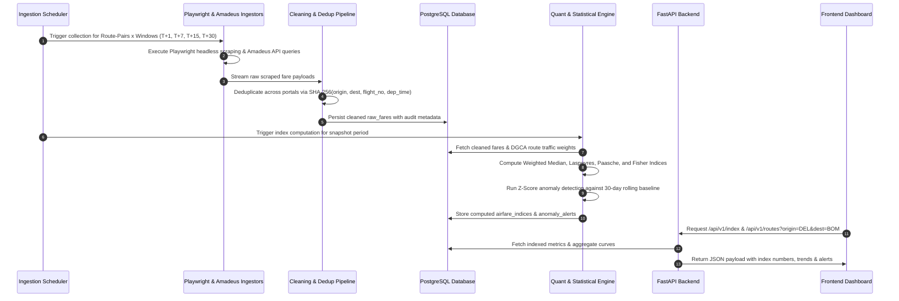

# APIx System Architecture Blueprint
## Real-time Airfare Price Index for India (SIH 2026 Problem Statement 26056)

---

### 1. Executive Summary & Problem Domain

#### 1.1 The Challenge
The **Consumer Price Index (CPI)** published by the Ministry of Statistics and Programme Implementation (MoSPI) serves as India's benchmark indicator for macroeconomic inflation and monetary policy formulation by the Reserve Bank of India (RBI). However, the airfare component in the current CPI framework suffers from severe structural limitations:
1. **Low Frequency & High Latency:** Monthly manual reporting fails to capture high-velocity price fluctuations driven by dynamic pricing algorithms.
2. **Narrow Sample Coverage:** Currently calculated using manual surveys from select travel agents covering merely ~10% of airline ticketing volume.
3. **Absence of Booking Window Horizons:** Real-world airfares vary drastically based on purchase lead time ($T+1, T+7, T+15, T+30$). Legacy CPI ignores booking horizon dynamics entirely.
4. **State-Level vs. Route-Level Granularity:** Airfare inflation is heavily route-dependent and concentrated along high-density trunk routes (e.g., DEL-BOM, BLR-DEL).

#### 1.2 The APIx Mission
**APIx (Airfare Price Index)** automates high-frequency airfare intelligence across major Indian carriers (IndiGo, Air India, SpiceJet, Akasa) and Online Travel Aggregators (OTAs: MakeMyTrip, EaseMyTrip, Cleartrip) via headless browser automation (Playwright) and GDS APIs (Amadeus). By weighting route-level fares with Directorate General of Civil Aviation (**DGCA**) passenger traffic data and applying Laspeyres, Paasche, and Fisher Ideal Index formulations, APIx provides:
- **Augmented CPI Airfare Sub-Index:** Daily and sub-daily indices for national and regional transport inflation.
- **Dynamic Booking Horizon Curves:** Fare progression across $T+1, T+7, T+15, T+30$ advance windows.
- **Regulatory Surveillance & Anomaly Alerts:** Automated detection of abnormal surge pricing and capacity bottlenecks for DGCA oversight.

---

### 2. High-Level System Architecture (C4 Container View)

```
+--------------------------------------------------------------------------------------------------+
|                                    APIx SYSTEM ARCHITECTURE                                      |
+--------------------------------------------------------------------------------------------------+

   [ External Sources ]
     +-- Playwright Headless Workers (IndiGo, Air India, SpiceJet, MakeMyTrip, EaseMyTrip)
     +-- GDS API Connectors (Amadeus Flight Offers API)
     +-- DGCA Public Portal (City-pair passenger traffic reports)
            |
            v
   [ 1. Ingestion & Scraper Subsystem ]
     +-- Distributed Task Scheduler (APScheduler / Celery)
     +-- Anti-bot / Rate-Limiting & Rotating User-Agent Proxy Manager
     +-- Raw Fare Extraction & Telemetry Capture
            |
            v
   [ 2. Data Cleaning & Normalization Pipeline ]
     +-- Flight & Fare Deduplication Engine (Hashing origin + dest + flight_no + departure)
     +-- Currency & Fare Class Normalization (Economy non-stop vs 1-stop standard)
     +-- Validation & Sanity Bounds Filter (Reject invalid 0 or extreme outlier artifacts)
            |
            v
   [ 3. Storage Layer (PostgreSQL / TimescaleDB) ]
     +-- airports, routes, airlines
     +-- dgca_passenger_traffic_weights
     +-- raw_fares (partitioned by recorded_at)
     +-- airfare_indices (composite national & route-level)
     +-- anomaly_alerts
            |
            +------------------------------+
            |                              |
            v                              v
   [ 4. Statistical & Quant Engine ]    [ 5. Anomaly & Alerting Engine ]
     +-- Route Weighted Median            +-- Rolling Z-Score & IQR Outlier Filter
     +-- Laspeyres Index ($I_L$)          +-- Sudden Spike Surveillance
     +-- Paasche Index ($I_P$)            +-- DGCA Regulatory Alert Dispatch
     +-- Fisher Ideal Index ($I_F$)
     +-- Booking Horizon Decomp
            |                              |
            +--------------+---------------+
                           |
                           v
   [ 6. Backend API Service Layer (FastAPI) ]
     +-- /api/v1/index       : National & regional composite indices
     +-- /api/v1/routes      : Route-level fare curves & booking window matrices
     +-- /api/v1/trends      : Historical inflation trends & CPI comparisons
     +-- /api/v1/anomalies   : Real-time surge pricing & regulatory alerts
     +-- /api/v1/ingestion   : Scraper telemetry & data oversight metrics
            |
            v
   [ 7. Interactive Frontend Dashboard (React / Vite) ]
     +-- Real-time National Index Ticker & CPI Delta Indicator
     +-- Interactive Route-Pair Heatmap (Geospatial Traffic Density)
     +-- Booking Window Advance Curve Visualization ($T+1 \rightarrow T+30$)
     +-- DGCA Regulatory Incident & Anomaly Feed
```

---

### 3. Detailed Data Flow Architecture

The data lifecycle within APIx traverses five sequential phases:



---

### 4. Mathematical Formulation of the Airfare Price Index

#### 4.1 Route Representative Fare
For route $r$ observed at time $t$ across booking horizon $h \in \{1, 7, 15, 30\}$ days, multiple carriers and OTAs report fares $\{p_{r,h,k}\}_{k=1}^m$. To eliminate outlier scraping artifacts, the representative fare $P_{t,r,h}$ is calculated using the **Weighted Median** of deduplicated quotes:

$$P_{t,r,h} = \text{WeightedMedian}\left(\{p_{r,h,k}\}_{k=1}^m\right)$$

#### 4.2 Booking Horizon Composite
Domestic air travel in India exhibits distinct purchasing horizon weights $w_h$ based on DGCA booking lead-time distributions:
- $T+1$ (Emergency / Immediate): $w_1 = 0.15$
- $T+7$ (Short-lead leisure / business): $w_7 = 0.35$
- $T+15$ (Standard planning): $w_{15} = 0.30$
- $T+30$ (Early discount / holiday): $w_{30} = 0.20$

The route aggregate price at period $t$ is:

$$P_{t,r} = \sum_{h \in \{1, 7, 15, 30\}} w_h \cdot P_{t,r,h}$$

#### 4.3 Route Traffic Weighting & Index Aggregation
Let $Q_{0,r}$ represent the baseline passenger traffic volume on route $r$ derived from DGCA quarterly traffic reports, and $Q_{t,r}$ represent current period traffic estimates.

1. **Laspeyres Price Index ($I_L$):** Base-period quantity weighted:
   $$I_{L,t} = \frac{\sum_{r=1}^N P_{t,r} \cdot Q_{0,r}}{\sum_{r=1}^N P_{0,r} \cdot Q_{0,r}} \times 100$$

2. **Paasche Price Index ($I_P$):** Current-period quantity weighted:
   $$I_{P,t} = \frac{\sum_{r=1}^N P_{t,r} \cdot Q_{t,r}}{\sum_{r=1}^N P_{0,r} \cdot Q_{t,r}} \times 100$$

3. **Fisher Ideal Price Index ($I_F$):** The geometric mean of Laspeyres and Paasche, satisfying time-reversal and factor-reversal tests:
   $$I_{F,t} = \sqrt{I_{L,t} \cdot I_{P,t}}$$

#### 4.4 Anomaly & Regulatory Surge Detection
An anomaly alert is triggered for route $r$ and horizon $h$ when the observed fare deviates significantly from its historical rolling mean $\mu_{r,h,30}$ and standard deviation $\sigma_{r,h,30}$:

$$Z_{t,r,h} = \frac{P_{t,r,h} - \mu_{r,h,30}}{\sigma_{r,h,30}}$$

- **Severity Warning:** $Z \ge 2.5$ (or $\ge +40\%$ above 30-day baseline)
- **Severity Critical (DGCA Alert):** $Z \ge 3.5$ (or $\ge +75\%$ above 30-day baseline)

---

### 5. Database Schema Blueprint

```sql
-- Core Airports
CREATE TABLE airports (
    iata_code VARCHAR(3) PRIMARY KEY,
    name VARCHAR(255) NOT NULL,
    city VARCHAR(100) NOT NULL,
    state VARCHAR(100) NOT NULL,
    latitude DOUBLE PRECISION,
    longitude DOUBLE PRECISION,
    is_metro BOOLEAN DEFAULT FALSE
);

-- Monitored Route Pairs
CREATE TABLE routes (
    id SERIAL PRIMARY KEY,
    origin_iata VARCHAR(3) REFERENCES airports(iata_code),
    destination_iata VARCHAR(3) REFERENCES airports(iata_code),
    distance_km INT,
    is_active BOOLEAN DEFAULT TRUE,
    created_at TIMESTAMPTZ DEFAULT NOW(),
    UNIQUE(origin_iata, destination_iata)
);

-- DGCA Traffic Weights (Passenger volume by city pair)
CREATE TABLE dgca_passenger_traffic_weights (
    id SERIAL PRIMARY KEY,
    route_id INT REFERENCES routes(id),
    period_year INT NOT NULL,
    period_quarter INT NOT NULL,
    passenger_count BIGINT NOT NULL,
    traffic_share_weight NUMERIC(8, 6) NOT NULL,
    updated_at TIMESTAMPTZ DEFAULT NOW(),
    UNIQUE(route_id, period_year, period_quarter)
);

-- Cleaned Raw Fares
CREATE TABLE raw_fares (
    id BIGSERIAL PRIMARY KEY,
    dedup_hash VARCHAR(64) NOT NULL,
    source_portal VARCHAR(50) NOT NULL,      -- 'amadeus', 'makemytrip', 'indigo', 'easemytrip'
    airline_code VARCHAR(3) NOT NULL,        -- '6E', 'AI', 'SG', 'QP'
    flight_number VARCHAR(20) NOT NULL,
    route_id INT REFERENCES routes(id),
    origin_iata VARCHAR(3) NOT NULL,
    destination_iata VARCHAR(3) NOT NULL,
    departure_time TIMESTAMPTZ NOT NULL,
    arrival_time TIMESTAMPTZ NOT NULL,
    fare_amount NUMERIC(10, 2) NOT NULL,
    currency VARCHAR(3) DEFAULT 'INR',
    cabin_class VARCHAR(20) DEFAULT 'ECONOMY',
    booking_window VARCHAR(5) NOT NULL,      -- 'T1', 'T7', 'T15', 'T30'
    is_nonstop BOOLEAN DEFAULT TRUE,
    recorded_at TIMESTAMPTZ DEFAULT NOW()
);

-- Airfare Price Indices
CREATE TABLE airfare_indices (
    id BIGSERIAL PRIMARY KEY,
    calculation_timestamp TIMESTAMPTZ NOT NULL,
    period VARCHAR(20) NOT NULL,             -- e.g., '2026-09-24' or '2026-W39'
    index_type VARCHAR(30) NOT NULL,         -- 'fisher', 'laspeyres', 'paasche', 'weighted_median'
    booking_window VARCHAR(10) NOT NULL,     -- 'T1', 'T7', 'T15', 'T30', 'COMPOSITE'
    route_id INT REFERENCES routes(id),     -- NULL denotes National Composite
    index_value NUMERIC(10, 4) NOT NULL,
    base_value NUMERIC(10, 4) DEFAULT 100.0,
    pct_change_mom NUMERIC(6, 3),            -- Month-over-month % change
    pct_change_yoy NUMERIC(6, 3),            -- Year-over-year % change
    sample_size INT NOT NULL,
    created_at TIMESTAMPTZ DEFAULT NOW()
);

-- Anomaly & Regulatory Alerts
CREATE TABLE anomaly_alerts (
    id BIGSERIAL PRIMARY KEY,
    route_id INT REFERENCES routes(id),
    booking_window VARCHAR(5) NOT NULL,
    detected_at TIMESTAMPTZ DEFAULT NOW(),
    observed_fare NUMERIC(10, 2) NOT NULL,
    baseline_fare NUMERIC(10, 2) NOT NULL,
    z_score NUMERIC(6, 3) NOT NULL,
    percent_surge NUMERIC(6, 2) NOT NULL,
    severity VARCHAR(20) NOT NULL,           -- 'INFO', 'WARNING', 'CRITICAL'
    alert_status VARCHAR(20) DEFAULT 'OPEN', -- 'OPEN', 'ACKNOWLEDGED', 'RESOLVED'
    regulatory_notified BOOLEAN DEFAULT FALSE
);
```

---

### 6. Deployment Topology & Container Architecture

```
+---------------------------------------------------------------------------------------+
|                                PRODUCTION DEPLOYMENT                                  |
+---------------------------------------------------------------------------------------+
|                                                                                       |
|   [ Internet / Clients / Regulators ]                                                 |
|               |                                                                       |
|               v                                                                       |
|   +---------------------------------------+                                           |
|   | Reverse Proxy / TLS (Nginx / Traefik) |                                           |
|   +---------------------------------------+                                           |
|               |                                                                       |
|       +-------+---------------------------------------+                               |
|       |                                               |                               |
|       v                                               v                               |
|   +--------------------------+            +----------------------------------+        |
|   | Frontend Web Container   |            | FastAPI Application Backend      |        |
|   | (Nginx serving SPA build)|            | (Uvicorn ASGI Workers, 4 Procs)  |        |
|   +--------------------------+            +----------------------------------+        |
|                                                       |                               |
|       +-----------------------------------------------+                               |
|       |                                                                               |
|       v                                                                               |
|   +----------------------------------+    +----------------------------------+        |
|   | PostgreSQL 16 + TimescaleDB      |    | Ingestion Scraper Cluster        |        |
|   | - Relational & Time-series data  |    | - Playwright Headless Containers |        |
|   | - Connection Pooling (asyncpg)   |    | - Amadeus API Connector          |        |
|   +----------------------------------+    | - Task Scheduler (APScheduler)   |        |
|                                           +----------------------------------+        |
|                                                                                       |
+---------------------------------------------------------------------------------------+
```

#### 6.1 Container Specifications
- **`apix-backend`:** FastAPI application exposing RESTful JSON endpoints.
- **`apix-database`:** PostgreSQL 16 instance storing relational metadata and time-series fares.
- **`apix-ingestion`:** Headless Playwright worker container equipped with Chromium dependencies and scheduling daemon.
- **`apix-frontend`:** React 19 + TypeScript + Vite single page application with Tailwind CSS and Recharts / Leaflet.

---

### 7. Security, Resilience & Compliance

1. **Scraper Ethics & Rate-Limiting:** Adheres strictly to automated collection delays (minimum 2.5s jitter between portal requests), respecting `robots.txt` guidelines, and prioritizing authorized GDS API feeds (Amadeus).
2. **Secrets & Credentials Management:** Zero hardcoded credentials. All API keys (`AMADEUS_CLIENT_ID`, `INGESTION_SECRET_KEY`) managed via environment variables.
3. **Data Integrity & Immutability:** Raw scrape records are immutable and stored with SHA-256 deduplication hashes to ensure auditability for DGCA regulators.
4. **Graceful Degradation:** If external OTA scraping encounters anti-bot challenges or downtime, the pipeline gracefully falls back to Amadeus GDS API feeds, logging telemetry without interrupting index calculations.
