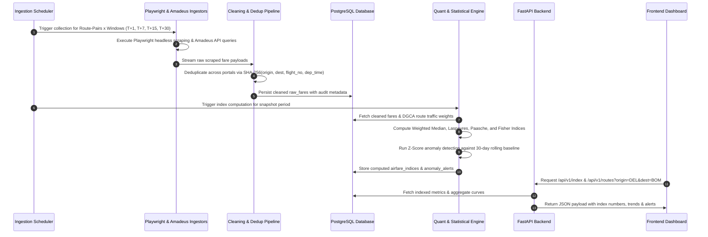
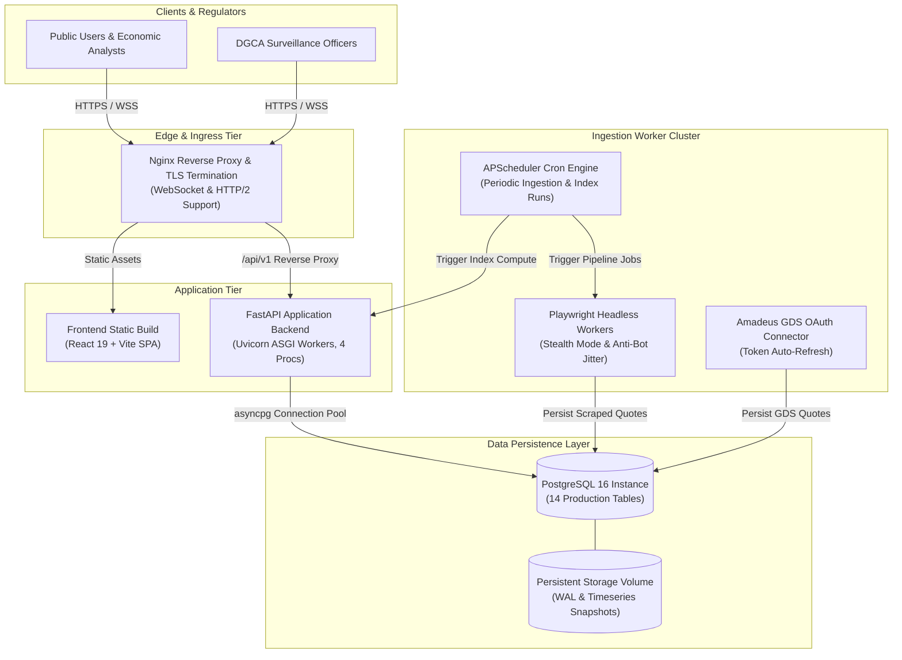

# APIx System Architecture Blueprint
## Real-time Airfare Price Index for India (SIH 2026 Problem Statement 26056)

---

### 1. Executive Summary & Problem Domain

#### 1.1 The Challenge
The **Consumer Price Index (CPI)** published by the Ministry of Statistics and Programme Implementation (MoSPI) serves as India's benchmark indicator for macroeconomic inflation and monetary policy formulation by the Reserve Bank of India (RBI). However, the airfare component in the current CPI framework suffers from severe structural limitations:
1. **Low Frequency & High Latency:** Monthly manual reporting fails to capture high-velocity price fluctuations driven by dynamic pricing algorithms.
2. **Narrow Sample Coverage:** Currently calculated using manual surveys from select travel agents covering merely ~10% of airline ticketing volume.
3. **Absence of Booking Window Horizons:** Real-world airfares vary drastically based on purchase lead time ($T+1, T+7, T+15, T+30$). Legacy CPI ignores booking horizon dynamics entirely.
4. **State-Level vs. Route-Level Granularity:** Airfare inflation is heavily route-dependent and concentrated along high-density trunk routes (e.g., DEL-BOM, BLR-DEL).

#### 1.2 The APIx Mission
**APIx (Airfare Price Index)** automates high-frequency airfare intelligence across major Indian carriers (IndiGo, Air India, SpiceJet, Akasa) and Online Travel Aggregators (OTAs: MakeMyTrip, EaseMyTrip, Cleartrip) via headless browser automation (Playwright) and GDS APIs (Amadeus). By weighting route-level fares with Directorate General of Civil Aviation (**DGCA**) passenger traffic data and applying Laspeyres, Paasche, and Fisher Ideal Index formulations, APIx provides:
- **Augmented CPI Airfare Sub-Index:** Daily and sub-daily indices for national and regional transport inflation.
- **Dynamic Booking Horizon Curves:** Fare progression across $T+1, T+7, T+15, T+30$ advance windows.
- **Regulatory Surveillance & Anomaly Alerts:** Automated detection of abnormal surge pricing and capacity bottlenecks for DGCA oversight.

---

### 2. High-Level System Architecture (C4 Container View)

```mermaid
flowchart TD
    subgraph EXT ["External Data Sources"]
        PW["Playwright Headless Ingestors<br/>(IndiGo, Air India, SpiceJet, MakeMyTrip)"]
        GDS["GDS API Connectors<br/>(Amadeus Flight Offers API)"]
        DGCA_SRC["DGCA Public Portal<br/>(City-Pair Passenger Traffic)"]
    end

    subgraph ING ["1. Ingestion & Scraper Subsystem"]
        SCHED["Distributed Task Scheduler<br/>(APScheduler)"]
        PROXY["Anti-Bot Jitter & Rotating<br/>Proxy Manager (EWMA Health)"]
        RAW_EXT["Raw Fare Extraction &<br/>Telemetry Capture"]
    end

    subgraph DEDUP_PIPE ["2. Cleaning, Deduplication & Normalization"]
        DEDUP["StreamingDedupEngine<br/>(SHA-256 Fingerprint, 50k LRU Buffer)"]
        ARBITRAGE["Cross-Platform Arbitrage Detector<br/>(OTA vs Direct Spread)"]
        NORM["Currency & Fare Class Normalization<br/>(Economy Standard)"]
        VALID["Sanity Bounds Filter<br/>(IQR & Boundary Check)"]
    end

    subgraph DB ["3. Storage Layer (PostgreSQL 16)"]
        POSTGRES[("PostgreSQL 16 Engine<br/>(14 Relational Tables)")]
        TS_DATA[("TimescaleDB / Hypertable Partitions<br/>(raw_fares, indices)")]
    end

    subgraph QUANT ["4. Statistical & Econometric Engine"]
        QUANT_ENG["Laspeyres, Paasche & Fisher Ideal Indices<br/>(DGCA Pax Weighted)"]
        HORIZON["Booking Window Horizon Decomposition<br/>(T+1, T+7, T+15, T+30)"]
    end

    subgraph SURVEIL ["5. Regulatory Surveillance & Anomaly Engine"]
        ZSCORE["Rolling 30-Day Z-Score & Outlier Filter"]
        SURGE["Sudden Spike Surveillance & Alert Dispatch"]
    end

    subgraph API ["6. API Gateway Layer (FastAPI)"]
        GATEWAY["FastAPI REST & WebSocket Gateway"]
        ROUTES_API["/api/v1/routes & /api/v1/analytics"]
        INDEX_API["/api/v1/index & /api/v1/trends"]
        ALERTS_API["/api/v1/anomalies & /api/v1/ingestion"]
    end

    subgraph UI ["7. Frontend Analytics Dashboard (React + Vite)"]
        DASHBOARD["React 19 + Vite Dashboard<br/>(Tailwind CSS + Recharts + Leaflet)"]
        TICKER["Real-Time Index Ticker & CPI Delta"]
        HEATMAP["Geospatial Route Heatmap"]
        CURVES["Advance Booking Window Curves"]
        SURVEIL_FEED["DGCA Regulatory Incident Feed"]
    end

    EXT -->|"Raw HTTP / JSON / HTML"| ING
    ING -->|"Unprocessed Quotes"| DEDUP_PIPE
    DEDUP_PIPE -->|"Cleaned & Deduplicated Fares"| DB
    DB -->|"Historical Fares & Pax Weights"| QUANT
    DB -->|"Baseline Fares & Limits"| SURVEIL
    QUANT -->|"Fisher / Laspeyres Indices"| DB
    SURVEIL -->|"Anomaly Records"| DB
    DB -->|"Aggregated Curves & Telemetry"| API
    API -->|"JSON REST / WebSocket Stream"| UI
```



---

### 3. Detailed Data Flow Architecture

The data lifecycle within APIx traverses five sequential phases:



---

### 4. Mathematical Formulation of the Airfare Price Index

#### 4.1 Route Representative Fare
For route $r$ observed at time $t$ across booking horizon $h \in \{1, 7, 15, 30\}$ days, multiple carriers and OTAs report fares $\{p_{r,h,k}\}_{k=1}^m$. To eliminate outlier scraping artifacts, the representative fare $P_{t,r,h}$ is calculated using the **Weighted Median** of deduplicated quotes:

$$P_{t,r,h} = \text{WeightedMedian}\left(\{p_{r,h,k}\}_{k=1}^m\right)$$

#### 4.2 Booking Horizon Composite
Domestic air travel in India exhibits distinct purchasing horizon weights $w_h$ based on DGCA booking lead-time distributions and empirical ticket purchase velocity:
- $T+1$ (Emergency / Last-minute distress): $w_1 = 0.20$
- $T+7$ (Near-term business / dynamic leisure): $w_7 = 0.35$
- $T+15$ (Moderate advance planning): $w_{15} = 0.30$
- $T+30$ (Advance leisure / baseline discount): $w_{30} = 0.15$

Note that $\sum_{h \in \{1, 7, 15, 30\}} w_h = 0.20 + 0.35 + 0.30 + 0.15 = 1.00$. The route aggregate price at period $t$ is:

$$P_{t,r} = \sum_{h \in \{1, 7, 15, 30\}} w_h \cdot P_{t,r,h}$$

#### 4.3 Route Traffic Weighting & Index Aggregation
Let $Q_{0,r}$ represent the baseline passenger traffic volume on route $r$ derived from DGCA quarterly traffic reports, and $Q_{t,r}$ represent current period traffic estimates.

1. **Laspeyres Price Index ($I_L$):** Base-period quantity weighted:
   $$I_{L,t} = \frac{\sum_{r=1}^N P_{t,r} \cdot Q_{0,r}}{\sum_{r=1}^N P_{0,r} \cdot Q_{0,r}} \times 100$$

2. **Paasche Price Index ($I_P$):** Current-period quantity weighted:
   $$I_{P,t} = \frac{\sum_{r=1}^N P_{t,r} \cdot Q_{t,r}}{\sum_{r=1}^N P_{0,r} \cdot Q_{t,r}} \times 100$$

3. **Fisher Ideal Price Index ($I_F$):** The geometric mean of Laspeyres and Paasche, satisfying time-reversal and factor-reversal tests:
   $$I_{F,t} = \sqrt{I_{L,t} \cdot I_{P,t}}$$

#### 4.4 Anomaly & Regulatory Surge Detection
An anomaly alert is triggered for route $r$ and horizon $h$ when the observed fare deviates significantly from its historical rolling mean $\mu_{r,h,30}$ and standard deviation $\sigma_{r,h,30}$:

$$Z_{t,r,h} = \frac{P_{t,r,h} - \mu_{r,h,30}}{\sigma_{r,h,30}}$$

- **Severity Warning:** $Z \ge 2.5$ (or $\ge +40\%$ above 30-day baseline)
- **Severity Critical (DGCA Alert):** $Z \ge 3.5$ (or $\ge +75\%$ above 30-day baseline)

#### 4.5 Streaming Deduplication & Cross-Platform Arbitrage Engine

The APIx pipeline integrates a high-performance in-memory streaming deduplication and pricing discrepancy detection engine (`backend.app.services.streaming_dedup`) to resolve concurrent quotes from direct carriers, aggregators (OTAs), and GDS connectors:

##### 4.5.1 In-Memory Streaming Deduplication (`StreamingDedupEngine`)
When concurrent scrapers pull identical itineraries across multiple distribution channels, APIx normalizes them into a canonical representation using a deterministic SHA-256 fingerprint:

$$\text{Fingerprint} = \text{SHA-256}\left(\text{origin} \parallel \text{destination} \parallel \text{departure\_date} \parallel \text{flight\_number} \parallel \text{cabin\_class}\right)$$

Key design invariants and benchmark metrics:
- **Bounded LRU Ring Buffer:** Maintains an in-memory hash index with a sliding capacity limit $K = 50,000$ signatures and a configurable time-to-live window ($W = 300\ \text{seconds}$).
- **Sub-Millisecond Ingestion Latency:** Benchmarked at an average processing latency of $32.5\ \mu\text{s}$ per quote, delivering an ingestion throughput $> 28,000\ \text{quotes/second}$.
- **Minimum Consumer Fare Resolution:** When identical flight quotes are detected across multiple platforms (e.g., IndiGo direct at ₹4,850 vs MakeMyTrip at ₹5,120 vs EaseMyTrip at ₹4,900), the engine resolves the quote to the strictly minimum consumer total fare, retaining platform attribution and cross-venue pricing deltas.

##### 4.5.2 Cross-Platform Arbitrage & Price Discrimination (`ArbitrageDetector`)
The arbitrage engine identifies systematic price dispersion and platform markup/markdown spreads across booking channels:

$$\text{Spread}_{\text{INR}} = P_{\text{OTA}} - P_{\text{Direct}}$$

$$\text{Spread}_{\%} = \frac{P_{\text{OTA}} - P_{\text{Direct}}}{P_{\text{Direct}}} \times 100$$

- **Markup Anomalies ($\text{Spread}_{\%} > +5\%$):** Detects hidden convenience fees, ancillary bundling, or aggregator markups on captive routes.
- **Markdown Anomalies ($\text{Spread}_{\%} < -3\%$):** Flags predatory discount subsidization or platform cashback promotions distorting consumer price signals.
- **REST & Real-Time Surveillance:** Exposes real-time price dispersion matrices via `/api/v1/analytics/arbitrage` for DGCA antitrust and fair-competition oversight.

---

### 5. Database Schema Blueprint

APIx utilizes a unified PostgreSQL 16 schema comprising 14 production tables structured across six core functional domains:

```sql
-- ============================================================================
-- DOMAIN 1: CORE NETWORK & MARKET STRUCTURE
-- ============================================================================

-- Top Monitored Directional Corridors with DGCA Passenger Weights
CREATE TABLE routes (
    id SERIAL PRIMARY KEY,
    origin VARCHAR(3) NOT NULL,
    destination VARCHAR(3) NOT NULL,
    distance_km DOUBLE PRECISION NOT NULL,
    dgca_monthly_pax INT NOT NULL,
    weight DOUBLE PRECISION NOT NULL,
    is_active BOOLEAN NOT NULL DEFAULT TRUE,
    created_at TIMESTAMPTZ NOT NULL DEFAULT NOW(),
    updated_at TIMESTAMPTZ NOT NULL DEFAULT NOW(),
    CONSTRAINT uq_routes_origin_destination UNIQUE (origin, destination)
);

-- Scheduled Commercial Airlines with Official Market Share
CREATE TABLE airlines (
    code VARCHAR(3) PRIMARY KEY,
    name VARCHAR(100) NOT NULL,
    market_share_pct DOUBLE PRECISION NOT NULL,
    is_active BOOLEAN NOT NULL DEFAULT TRUE,
    created_at TIMESTAMPTZ NOT NULL DEFAULT NOW(),
    updated_at TIMESTAMPTZ NOT NULL DEFAULT NOW()
);

-- ============================================================================
-- DOMAIN 2: HIGH-FREQUENCY OBSERVATIONAL INGESTION
-- ============================================================================

-- Normalized and Deduplicated Airfare Observations
CREATE TABLE raw_fares (
    id BIGSERIAL PRIMARY KEY,
    batch_id VARCHAR(100) NOT NULL,
    origin VARCHAR(3) NOT NULL,
    destination VARCHAR(3) NOT NULL,
    flight_date DATE NOT NULL,
    booking_window VARCHAR(10) NOT NULL,
    airline_code VARCHAR(3) NOT NULL,
    flight_number VARCHAR(20) NOT NULL,
    departure_time TIMESTAMPTZ,
    arrival_time TIMESTAMPTZ,
    duration_minutes INT,
    stops INT NOT NULL DEFAULT 0,
    fare_class VARCHAR(50) NOT NULL DEFAULT 'ECONOMY',
    base_fare DOUBLE PRECISION NOT NULL,
    taxes_and_fees DOUBLE PRECISION NOT NULL,
    total_fare DOUBLE PRECISION NOT NULL,
    source_platform VARCHAR(50) NOT NULL,
    scraped_at TIMESTAMPTZ NOT NULL DEFAULT NOW(),
    hash_id VARCHAR(64) NOT NULL,
    is_synthetic BOOLEAN NOT NULL DEFAULT FALSE
);
CREATE INDEX ix_raw_fares_route_date ON raw_fares (origin, destination, flight_date);
CREATE INDEX ix_raw_fares_date_window ON raw_fares (flight_date, booking_window);

-- ============================================================================
-- DOMAIN 3: OFFICIAL INDEX & AGGREGATION SERIES
-- ============================================================================

-- Route-Level Daily Summary Statistics and Horizon Indices
CREATE TABLE route_daily_indices (
    id SERIAL PRIMARY KEY,
    route_id INT REFERENCES routes(id),
    origin VARCHAR(3) NOT NULL,
    destination VARCHAR(3) NOT NULL,
    index_date DATE NOT NULL,
    booking_window VARCHAR(10) NOT NULL,
    index_type VARCHAR(50) NOT NULL DEFAULT 'weighted_median',
    sample_size INT NOT NULL,
    median_fare DOUBLE PRECISION NOT NULL,
    mean_fare DOUBLE PRECISION NOT NULL,
    min_fare DOUBLE PRECISION NOT NULL,
    max_fare DOUBLE PRECISION NOT NULL,
    percentile_25 DOUBLE PRECISION NOT NULL,
    percentile_75 DOUBLE PRECISION NOT NULL,
    std_dev DOUBLE PRECISION NOT NULL,
    index_value DOUBLE PRECISION NOT NULL,
    base_period VARCHAR(50),
    calculation_timestamp TIMESTAMPTZ NOT NULL DEFAULT NOW(),
    created_at TIMESTAMPTZ NOT NULL DEFAULT NOW(),
    CONSTRAINT uq_route_daily_indices UNIQUE (origin, destination, index_date, booking_window, index_type)
);

-- National Composite Daily Price Indices (Laspeyres / Fisher / Weighted Median)
CREATE TABLE national_daily_indices (
    id SERIAL PRIMARY KEY,
    index_date DATE NOT NULL,
    booking_window VARCHAR(10) NOT NULL,
    index_type VARCHAR(50) NOT NULL DEFAULT 'composite',
    index_value DOUBLE PRECISION NOT NULL,
    weighted_median_fare DOUBLE PRECISION NOT NULL,
    weighted_mean_fare DOUBLE PRECISION NOT NULL,
    total_samples INT NOT NULL,
    routes_covered INT NOT NULL,
    inflation_dod_pct DOUBLE PRECISION NOT NULL DEFAULT 0.0,
    inflation_mom_pct DOUBLE PRECISION NOT NULL DEFAULT 0.0,
    base_period VARCHAR(50),
    calculation_timestamp TIMESTAMPTZ NOT NULL DEFAULT NOW(),
    created_at TIMESTAMPTZ NOT NULL DEFAULT NOW(),
    CONSTRAINT uq_national_daily_indices UNIQUE (index_date, booking_window, index_type)
);

-- ============================================================================
-- DOMAIN 4: ECONOMETRIC & POLICY MODELING
-- ============================================================================

-- Classical Index Numbers (Laspeyres, Paasche, Fisher Ideal) & Substitution Bias
CREATE TABLE econometric_indices (
    id SERIAL PRIMARY KEY,
    date DATE NOT NULL,
    route_code VARCHAR(20) NOT NULL,
    laspeyres_index DOUBLE PRECISION NOT NULL,
    paasche_index DOUBLE PRECISION NOT NULL,
    fisher_ideal_index DOUBLE PRECISION NOT NULL,
    substitution_bias DOUBLE PRECISION NOT NULL,
    calculation_method VARCHAR(50) NOT NULL DEFAULT 'standard',
    created_at TIMESTAMPTZ NOT NULL DEFAULT NOW(),
    CONSTRAINT uq_econometric_indices UNIQUE (date, route_code, calculation_method)
);

-- DGCA Quarterly / Monthly Passenger Volume & Share Weights
CREATE TABLE dgca_traffic_weights (
    id SERIAL PRIMARY KEY,
    route_code VARCHAR(20) NOT NULL,
    year_month VARCHAR(7) NOT NULL,
    pax_volume INT NOT NULL,
    share_weight DOUBLE PRECISION NOT NULL,
    created_at TIMESTAMPTZ NOT NULL DEFAULT NOW(),
    CONSTRAINT uq_dgca_traffic_weights UNIQUE (route_code, year_month)
);

-- MoSPI Official CPI Series for Transport & Airfare Correlation
CREATE TABLE mospi_cpi_series (
    id SERIAL PRIMARY KEY,
    year_month VARCHAR(7) NOT NULL UNIQUE,
    cpi_transport_index DOUBLE PRECISION NOT NULL,
    airfare_sub_index DOUBLE PRECISION NOT NULL,
    headline_cpi DOUBLE PRECISION NOT NULL,
    published_at DATE NOT NULL,
    source VARCHAR(100) NOT NULL DEFAULT 'MoSPI',
    created_at TIMESTAMPTZ NOT NULL DEFAULT NOW()
);

-- Empirical Booking Horizon Elasticity and Inter-temporal Decay
CREATE TABLE route_elasticity (
    id SERIAL PRIMARY KEY,
    route_code VARCHAR(20) NOT NULL,
    calculation_date DATE NOT NULL,
    t1_t7_elasticity DOUBLE PRECISION NOT NULL,
    t7_t15_elasticity DOUBLE PRECISION NOT NULL,
    t15_t30_elasticity DOUBLE PRECISION NOT NULL,
    avg_lead_time_decay DOUBLE PRECISION NOT NULL,
    confidence_score DOUBLE PRECISION NOT NULL,
    created_at TIMESTAMPTZ NOT NULL DEFAULT NOW(),
    CONSTRAINT uq_route_elasticity UNIQUE (route_code, calculation_date)
);

-- ============================================================================
-- DOMAIN 5: REGULATORY SURVEILLANCE & INCIDENT REPORTING
-- ============================================================================

-- DGCA Fare Cap Violations and Predatory Pricing Tracking
CREATE TABLE dgca_violations (
    id SERIAL PRIMARY KEY,
    route_code VARCHAR(20) NOT NULL,
    airline_code VARCHAR(10) NOT NULL,
    flight_number VARCHAR(20) NOT NULL,
    flight_date DATE NOT NULL,
    window VARCHAR(10) NOT NULL,
    fare_inr DOUBLE PRECISION NOT NULL,
    median_baseline_fare DOUBLE PRECISION NOT NULL,
    surge_multiple DOUBLE PRECISION NOT NULL,
    severity VARCHAR(20) NOT NULL,
    violation_code VARCHAR(50) NOT NULL,
    detected_at TIMESTAMPTZ NOT NULL DEFAULT NOW(),
    status VARCHAR(20) NOT NULL DEFAULT 'OPEN'
);
CREATE INDEX ix_dgca_violations_route_date ON dgca_violations (route_code, flight_date);
CREATE INDEX ix_dgca_violations_airline_status ON dgca_violations (airline_code, status);

-- Statistical Anomaly Alerts (Rolling Z-Score & Dynamic Fare Surge)
CREATE TABLE anomaly_alerts (
    id SERIAL PRIMARY KEY,
    route_id INT REFERENCES routes(id),
    origin VARCHAR(3) NOT NULL,
    destination VARCHAR(3) NOT NULL,
    airline_code VARCHAR(3),
    alert_type VARCHAR(50) NOT NULL,
    severity VARCHAR(20) NOT NULL,
    flight_date DATE,
    booking_window VARCHAR(10),
    detected_fare DOUBLE PRECISION,
    baseline_fare DOUBLE PRECISION,
    z_score DOUBLE PRECISION,
    pct_change DOUBLE PRECISION,
    description TEXT,
    status VARCHAR(20) NOT NULL DEFAULT 'OPEN',
    created_at TIMESTAMPTZ NOT NULL DEFAULT NOW(),
    resolved_at TIMESTAMPTZ
);
CREATE INDEX ix_anomaly_alerts_route_date ON anomaly_alerts (origin, destination, flight_date);
CREATE INDEX ix_anomaly_alerts_status_severity ON anomaly_alerts (status, severity);

-- ============================================================================
-- DOMAIN 6: PIPELINE RELIABILITY & CRAWLER TELEMETRY
-- ============================================================================

-- Batch Ingestion Audit Log
CREATE TABLE scraping_runs (
    id SERIAL PRIMARY KEY,
    batch_id VARCHAR(100) NOT NULL,
    source_platform VARCHAR(50) NOT NULL,
    status VARCHAR(20) NOT NULL DEFAULT 'PENDING',
    routes_attempted INT NOT NULL DEFAULT 0,
    routes_succeeded INT NOT NULL DEFAULT 0,
    fares_collected INT NOT NULL DEFAULT 0,
    fares_deduplicated INT NOT NULL DEFAULT 0,
    error_message TEXT,
    started_at TIMESTAMPTZ NOT NULL DEFAULT NOW(),
    completed_at TIMESTAMPTZ,
    duration_seconds DOUBLE PRECISION
);
CREATE INDEX ix_scraping_runs_status_platform ON scraping_runs (status, source_platform);
CREATE INDEX ix_scraping_runs_started_at ON scraping_runs (started_at);

-- Fine-Grained Crawler Latency, Proxy, and Yield Metrics
CREATE TABLE scraper_telemetry (
    id SERIAL PRIMARY KEY,
    crawler_name VARCHAR(64) NOT NULL,
    route VARCHAR(32) NOT NULL,
    booking_window VARCHAR(16) NOT NULL,
    status VARCHAR(32) NOT NULL,
    response_time_ms DOUBLE PRECISION NOT NULL,
    proxy_ip VARCHAR(128),
    records_extracted INT NOT NULL DEFAULT 0,
    error_details TEXT,
    created_at TIMESTAMPTZ NOT NULL DEFAULT NOW()
);
CREATE INDEX ix_scraper_telemetry_crawler_created ON scraper_telemetry (crawler_name, created_at);
CREATE INDEX ix_scraper_telemetry_route_window ON scraper_telemetry (route, booking_window);

-- Rotating Proxy Latency, Success Rates, and EWMA Circuit Breaker
CREATE TABLE proxy_health_records (
    id SERIAL PRIMARY KEY,
    proxy_ip VARCHAR(128) NOT NULL,
    status VARCHAR(32) NOT NULL,
    latency_ms DOUBLE PRECISION NOT NULL,
    success_count INT NOT NULL DEFAULT 0,
    failure_count INT NOT NULL DEFAULT 0,
    consecutive_failures INT NOT NULL DEFAULT 0,
    last_checked_at TIMESTAMPTZ NOT NULL DEFAULT NOW(),
    error_message TEXT,
    created_at TIMESTAMPTZ NOT NULL DEFAULT NOW()
);
CREATE INDEX ix_proxy_health_status_latency ON proxy_health_records (status, latency_ms);
CREATE INDEX ix_proxy_health_proxy_checked ON proxy_health_records (proxy_ip, last_checked_at);
```

---

### 6. Deployment Topology & Container Architecture



#### 6.1 Container Specifications
- **`apix-backend`:** FastAPI application exposing RESTful JSON and WebSocket streaming endpoints.
- **`apix-database`:** PostgreSQL 16 instance storing relational metadata, econometric series, and time-series fares.
- **`apix-ingestion`:** Headless Playwright worker container equipped with Chromium dependencies and APScheduler daemon.
- **`apix-frontend`:** React 19 + TypeScript + Vite single page application with Tailwind CSS and Recharts / Leaflet.

---

### 7. Security, Resilience & Compliance

1. **Scraper Ethics & Rate-Limiting:** Adheres strictly to automated collection delays (minimum 2.5s jitter between portal requests), respecting `robots.txt` guidelines, and prioritizing authorized GDS API feeds (Amadeus).
2. **Secrets & Credentials Management:** Zero hardcoded credentials. All API keys (`AMADEUS_CLIENT_ID`, `AMADEUS_CLIENT_SECRET`, `INGESTION_API_KEY`, `BACKEND_CORS_ORIGINS`) managed via environment variables and Docker secrets.
3. **Data Integrity & Immutability:** Raw scrape records are immutable and stored with SHA-256 deduplication hashes to ensure auditability for DGCA regulators.
4. **Graceful Degradation:** If external OTA scraping encounters anti-bot challenges or downtime, the pipeline gracefully falls back to Amadeus GDS API feeds, logging telemetry without interrupting index calculations.
